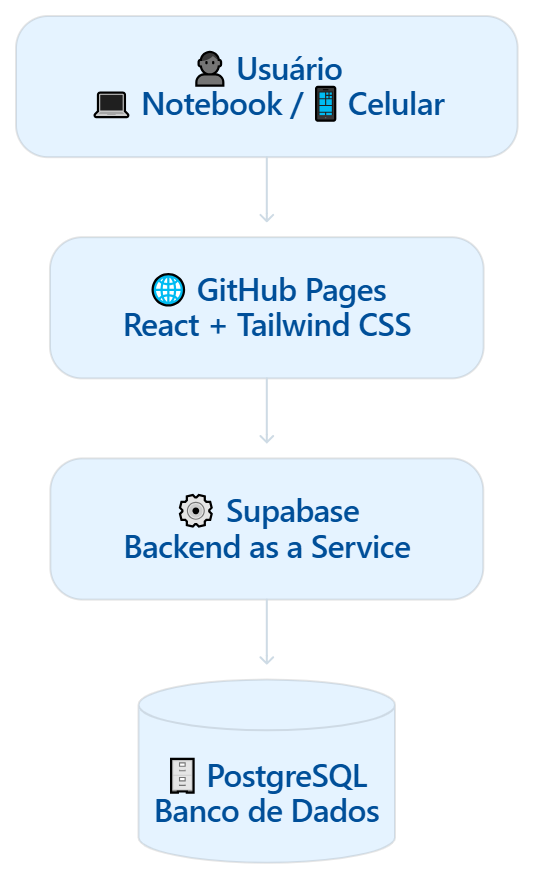
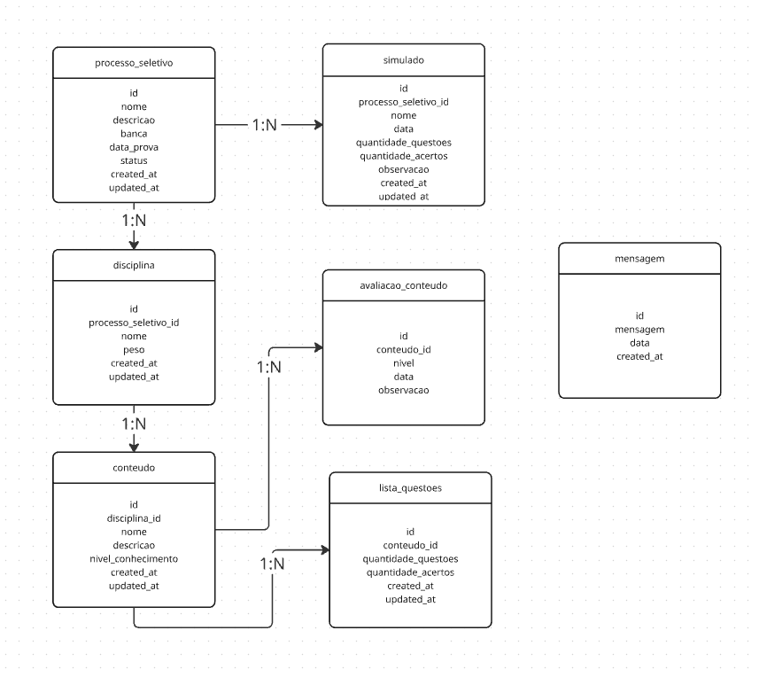

# AprovaHub

## 1. Sobre o projeto
O **AprovaHub** surgiu da necessidade de organizar e acompanhar a preparação para concursos públicos e processos seletivos, especialmente na área de Tecnologia da Informação.

O projeto tem como finalidade registrar os estudos realizados, monitorar o desempenho e permitir que o usuário classifique seu nível de conhecimento em diferentes disciplinas e conteúdos. Dessa forma, busca oferecer uma visão clara da evolução ao longo da preparação.

## 2. Objetivo
O objetivo principal do **AprovaHub** é acompanhar a evolução do aprendizado durante a preparação para diferentes concursos públicos e processos seletivos, auxiliando na identificação de conhecimentos já consolidados e de conteúdos que necessitam de maior atenção, tendo como finalidade apoiar o usuário em sua trajetória rumo à aprovação. 

## 3. Problema
A preparação para diferentes concursos públicos e processos seletivos envolve uma grande quantidade de disciplinas e conteúdos, tornando difícil acompanhar de forma organizada o que já foi estudado, o nível de domínio de cada conteúdo e a evolução do desempenho ao longo do tempo.

O AprovaHub busca solucionar essa dificuldade por meio do registro e acompanhamento dos estudos e dos resultados obtidos.

## 4. Escopo
Na primeira versão, o AprovaHub terá como principais funcionalidades:

- Cadastro de diferentes concursos públicos e processos seletivos;
- Cadastro de disciplinas vinculadas a cada processo seletivo;
- Cadastro dos conteúdos pertencentes a cada disciplina;
- Registro do nível de domínio de cada conteúdo, utilizando uma escala de 1 a 5;
- Registro do desempenho obtido em simulados;
- Consulta dos dados registrados para acompanhamento da evolução dos estudos.
- Fora do escopo da primeira versão

Para manter o projeto simples e permitir uma implementação inicial rápida, as seguintes funcionalidades não serão desenvolvidas inicialmente:

- Sistema de login e gerenciamento de usuários;
- Dashboard com indicadores e gráficos;
- Sistema de notificações e lembretes;
- Integração com plataformas externas de questões;
- Recursos avançados de gamificação.
- 
## 5. Requisitos funcionais
**RF01:** O sistema deve permitir cadastrar novos processos seletivos.

**RF02:** O sistema deve permitir cadastrar disciplinas vinculadas a cada processo seletivo.

**RF03:** O sistema deve permitir cadastrar conteúdos vinculados a cada disciplina.

**RF04:** O sistema deve permitir classificar o nível de conhecimento de cada conteúdo em uma escala de 1 a 5.

Na interface, a escala de domínio é apresentada com emojis e uma legenda permanente, mantendo os valores numéricos de 1 a 5 para os cálculos.

**RF05:** O sistema deve apresentar uma porcentagem de domínio dos conteúdos para cada processo seletivo.

**RF06:** O sistema deve permitir cadastrar um histórico de simulados, registrando o desempenho alcançado em cada um.

**RF07:** O sistema deve permitir adicionar uma mensagem ou observação a cada simulado, possibilitando registrar percepções sobre o próprio desempenho e evolução.

**RF08:** O sistema deve permitir que o usuário registre mensagens pessoais para si mesmo relacionadas à sua preparação.

**RF09:** O sistema deve permitir editar e excluir processos seletivos, disciplinas, conteúdos, simulados e mensagens cadastrados.

**RF10:** O sistema deve permitir consultar os registros cadastrados de forma organizada, possibilitando o acompanhamento da evolução dos estudos.

**RF11:** O sistema deve permitir definir o peso de cada disciplina dentro de um processo seletivo.

**RF12:** O sistema deve permitir alterar o peso de uma disciplina após seu cadastro.

**RF13:** O sistema deve permitir consultar o nível de domínio individual de cada disciplina, considerando os pesos definidos para o processo seletivo.

## 6. Requisitos não funcionais
**RNF01 — Responsividade:** O sistema deve apresentar uma interface adaptável a diferentes tamanhos de tela, permitindo sua utilização em computadores, notebooks, tablets e smartphones.

**RNF02 — Usabilidade:** A interface deve ser simples e intuitiva, permitindo que o usuário realize as principais operações sem necessidade de instruções complexas.

**RNF03 — Persistência:** Os dados cadastrados devem permanecer armazenados após o encerramento da aplicação e estar disponíveis quando o sistema for acessado novamente.

**RNF04 — Disponibilidade:** O sistema deve estar disponível por meio de uma aplicação web hospedada em serviço de acesso gratuito.

**RNF05 — Desempenho:** O sistema deve apresentar tempo de resposta adequado para as operações de consulta, cadastro, alteração e exclusão dos dados.

**RNF06 — Integridade dos dados:** O sistema deve impedir o cadastro de informações inválidas ou inconsistentes, respeitando as regras estabelecidas para cada tipo de dado.

**RNF07 — Segurança:** Os dados armazenados devem possuir mecanismos de proteção contra acessos ou alterações não autorizadas.

**RNF08 — Compatibilidade:** O sistema deve funcionar adequadamente nos principais navegadores modernos, como Google Chrome, Microsoft Edge e Mozilla Firefox.

**RNF09 — Manutenibilidade:** O código deve ser organizado de forma modular e padronizada, facilitando futuras correções, alterações e inclusão de novas funcionalidades.

**RNF10 — Versionamento:** O código-fonte e as alterações realizadas no projeto devem ser controlados por meio do Git e armazenados em um repositório GitHub.

## 7. Regras de Negócio

**RN01 — Processo seletivo:** Cada processo seletivo deve possuir um nome que permita sua identificação.

**RN02 — Disciplina:** Toda disciplina deve estar vinculada a um único processo seletivo.

**RN03 — Conteúdo:** Todo conteúdo deve estar vinculado a uma única disciplina.

**RN04 — Hierarquia:** A estrutura dos estudos deve seguir a hierarquia:

> Processo Seletivo → Disciplina → Conteúdo.

**RN05 — Nível de conhecimento:** O nível de conhecimento de um conteúdo deve ser classificado em uma escala de 1 a 5, sendo 1 o menor nível de domínio e 5 o maior.

**RN06 — Nível de conhecimento inicial:** Todo conteúdo cadastrado deve possuir um nível de conhecimento definido pelo usuário.

**RN07 — Porcentagem de domínio:** A porcentagem de domínio de um processo seletivo deve ser calculada com base nos níveis de conhecimento atribuídos aos seus conteúdos.

**RN08 — Simulados:** Todo simulado deve estar vinculado a um processo seletivo.

**RN09 — Desempenho:** O desempenho de um simulado deve ser calculado a partir da quantidade de questões e da quantidade de acertos informadas.

**RN10 — Validação do desempenho:** A quantidade de acertos não pode ser maior que a quantidade total de questões do simulado.

**RN11 — Mensagens:** As mensagens associadas aos simulados e as mensagens pessoais devem ser opcionais.

**RN12 — Exclusão:** Ao excluir um processo seletivo, suas disciplinas e conteúdos associados devem ser tratados de acordo com a regra de integridade definida no banco de dados.

**RN13 — Dados obrigatórios:** O sistema deve exigir o preenchimento dos campos obrigatórios antes de permitir o cadastro de um registro.

**RN14 — Identificação:** Cada registro deve possuir um identificador único no banco de dados.

**RN15 — Peso da disciplina:** Cada disciplina poderá possuir um peso definido de acordo com sua relevância no processo seletivo.

**RN16 — Peso padrão:** Caso o edital não estabeleça pesos diferentes entre as disciplinas, o sistema deverá considerar peso igual para todas.

**RN17 — Cálculo ponderado:** A porcentagem de domínio geral de um processo seletivo deverá considerar o nível de domínio dos conteúdos e o peso de suas respectivas disciplinas.

**RN18 — Domínio da disciplina:** O domínio de uma disciplina deverá ser calculado a partir dos níveis de conhecimento atribuídos aos seus conteúdos.

**RN19 — Domínio do processo seletivo:** O domínio geral do processo seletivo deverá ser obtido por meio da média ponderada do domínio das disciplinas, utilizando seus respectivos pesos.

## 8. Casos de uso
**UC01** – Gerenciar Processos Seletivos

**UC02** – Gerenciar Disciplinas e Pesos

**UC03** – Gerenciar Processos Seletivos

**UC04** – Gerenciar Conteúdos e Nível de Domínio

**UC05** – Registrar e Acompanhar Simulados

**UC06** – Gerenciar Mensagens Pessoais

**UC07** – Consultar Evolução e Domínio Geral

## 9. Arquitetura e Tecnologias

## 10. Modelagem do banco

## 12. Estrutura do projeto

## 13. Interface

O AprovaHub usa autenticação do Supabase Auth com e-mail e senha. Após entrar, o menu principal permite acessar processos seletivos, histórico de simulados e diário pessoal; também é possível encerrar a sessão. As contas são gerenciadas pelo Supabase, sem tabela de usuários própria.

Em simulados, é possível registrar o processo relacionado, a data, o total de questões, os acertos e uma observação opcional; o percentual de desempenho é calculado automaticamente. O diário permite registrar mensagens pessoais. Esses registros podem ser editados ou excluídos.

## 14. Testes

## 15. Deploy

## 16. Melhorias futuras